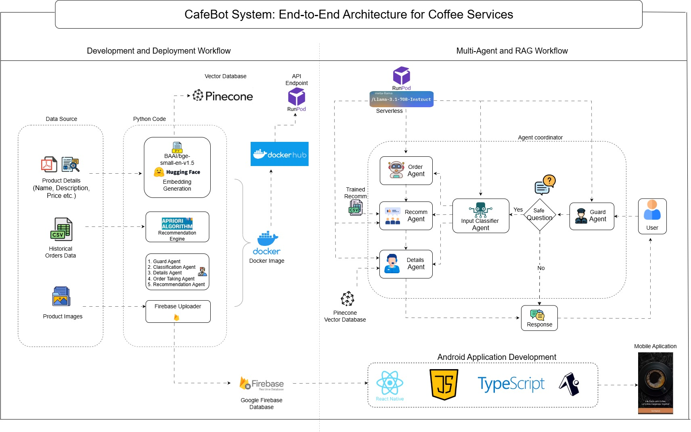

# BrewHaven-AI-Powered-Cafe-App

Welcome to the BrewHaven, an AI Agents powered cafe app! This repository contains the code and explanation of this project.

# Project Overview
Developed a cafe app with an AI chatbot that handles orders, recommends products using market basket analysis, provides café details, and filters irrelevant chats. Engineered and integrated five AI agents (Guard, Classifying, Detail, Recommendation, Order Taking) using RAG, Llama 3.1, Pinecone DB, BGE embeddings, and prompt engineering. Built two recommendation engines with Apriori algorithm and data mining techniques. Deployed the system via Docker on RunPod as an API endpoint and is currently developing a React Native app with real-time Firebase integration.

## 🧠 BrewBot Agent Architecture


## Tools and Technologies Used
This Project uses following tools and Technologies:
* AI Agents - 5 Agents
* Retrieval-Augmented Generation (RAG)
* Pinecone vector database
* Prompt Engineering - Chain of Thoughts, Input and Output Structuring
* Firebase database - To fetch cafe details from frontend
* Llama 3.1-8b-Instruct
* BGE Vector Embeddings
* Recommendation engine
* Data Mining - Apriori Algorithm - Market Basket Analysis
* React Native - Expo - Nativewind - for frontend
* Runpod - For deployment of LLM and Docker Image as API
* Docker - To write and build Docker file and image
* Coffee shop sales dataset from Kaggle

## Market Basket Analysis - Data Mining
Recommendation engine was built using Apriori algorithm. 2 recommendation engines were built:
* Popular Recommendation Engine: Based on the popular items in cafe. (Data Pre-Processing, Data Wrangling)
* Main Recommendation Engine: What goes well with which orders (Data Pre-Processing, Data Wrangling, Apriori Algorithm)

##Agents
The chatbot in this project is designed using a modular agent-based architecture, where each agent is responsible for a specific task, ensuring a seamless and efficient interaction between the user and the cafe's services. This architecture enables the chatbot to perform complex actions by delegating tasks to specialized agents, making the system highly flexible, scalable, and easy to extend.

### Key Agents in the System:
1. **Guard Agent:**
This agent acts as the first line of defense. It monitors all incoming user queries and ensures that only relevant and safe messages are processed by the other agents. It blocks inappropriate, harmful, or irrelevant queries, protecting the system and ensuring smooth conversations with users.

2. **Classification Agent:**
This is the decision-making agent. It classifies incoming user queries and determines which agent is best suited to handle the task. By categorizing user intents, it ensures that queries are routed efficiently, whether the user is asking for recommendations, placing an order, or inquiring about specific menu details.

3. **Details Agent (RAG System):**
Powered by a Retrieval-Augmented Generation (RAG) system, the Details Agent answers specific customer questions about the coffee shop, including menu details, ingredients, allergens, and other frequently asked questions. It retrieves relevant data stored in the vector database and combines it with language generation capabilities to provide clear and precise responses.

4. **Recommendation Agent:**
This agent handles personalized product recommendations by working with the market basket recommendation engine. Triggered by the Order Taking Agent, it analyzes the user's current order or preferences and suggests complementary items. This agent aims to boost upselling opportunities or help users discover new products they might like.

5. **Order Taking Agent:**
This agent is responsible for guiding customers through the order placement process. It uses chain-of-thought prompt engineering to simulate human-like reasoning, ensuring the order is accurately structured and all customer preferences are captured. It ensures that the chatbot gathers all necessary order details in a logical, step-by-step process, enhancing the reliability of the final order.

### ⚙️ How the Agents Work Together
The agents work collaboratively in a pipeline architecture to process user inputs:

1. A customer query is received and first assessed by the Guard Agent.
2. If valid, the Classification Agent determines the intent behind the user query (e.g., placing an order, asking about a product, or requesting a recommendation).
3. The query is then forwarded to the appropriate agent:
    * The Order Taking Agent handles order-related queries.
        * Order Agent can forward the order to the recommendation agent to try and upsell the user near the end of their order.
    * The Details Agent fetches specific menu information.
    * The Recommendation Agent suggests complementary products.


## React Native Interface


The React Native Coffee Shop App serves as the front-end interface for customers to interact with the AI-powered chatbot and explore the menu. Designed with a clean, intuitive user experience in mind, the app seamlessly integrates the chatbot for real-time customer service, enabling users to place orders, receive personalized product recommendations, and get detailed information about menu items.

### Key Features:
* **Landing Page:** A welcoming entry point to the coffee shop experience.
* **Home Page:** Displays featured menu items and product categories.
* **Item Details Page:** Provides detailed descriptions, including ingredients and allergens for each item.
* **Cart Page:** Allows users to review and modify their order before checkout.
* **Chatbot Interface:** Enables customers to interact directly with the AI chatbot for placing order, recommendations, and queries.

# 📂 Directory Structure
```bash
├── Brewhaven
│   ├── app # Contains React Native Frontend Code   
│   ├── python_code
│       ├── API/               # Chatbot API for agent-based system
│       ├── dataset/           # Dataset for training recommendation engine    
│       ├── products/          # Product data (names, prices, descriptions, images)   
│       ├── vector_database.py             # Builds vector database for RAG model   
│       ├── firebase.py                 # Uploads products to Firebase    
│       ├── recommendation_engine.py    # Trains recommendation engine 
```


## 🔗 Refrence Links
* [RunPod](https://docs.runpod.io/overview): RunPod Official Site - Infrastructure for deploying and scaling machine learning models.
* [Kaggle Dataset]([https://www.kaggle.com/datasets/ylchang/](https://www.kaggle.com/datasets/ylchang/coffee-shop-sample-data-1113)): Source of the dataset used for training the recommendation engine.
* [Figma app design](https://www.figma.com/design/PKEMJtsntUgQcN5xAIelkx/Coffee-Shop-Mobile-App-Design-(Community)?node-id=421-1221&node-type=FRAME&t=bakGV2g59KQ7cPBi-0): - The design mockups for the coffee shop app, providing a visual guide for the user interface and experience.
* [Hugging Face](https://huggingface.co/meta-llama/Llama-3.1-8B-Instruct): Hugging Face Models - Repository for Llama LLms, a state-of-the-art NLP model used in our chatbot.
* [Pinecone](https://docs.pinecone.io/guides/get-started/quickstart): Pinecone Documentation - Documentation for the vector database used in the project.
* [Firebase](https://firebase.google.com/docs): Firebase Documentation - Comprehensive guide for using Firebase to manage app data for the coffee shop app.
